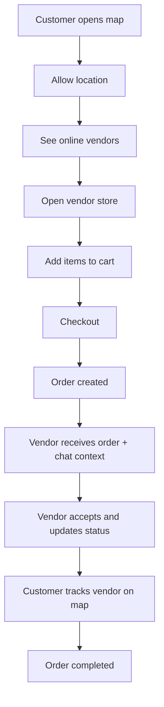

# Kelilingku Product Blueprint

## Product Statement

Kelilingku adalah platform map-first commerce untuk pedagang keliling. Pelanggan melihat pedagang yang sedang online di peta, memesan sebelum pedagang tiba, lalu memantau progres transaksi secara realtime.

Fokus utamanya bukan katalog umum, tetapi transaksi berbasis lokasi pedagang yang aktif saat ini.

## Core Value

- Pelanggan tahu pedagang ada di mana sekarang.
- Pedagang menerima order sebelum sampai ke pelanggan.
- Komunikasi, status order, dan titik temu jadi lebih teratur.

## Product Principles

- `Map-first`: peta adalah entry point utama setelah login.
- `Realtime by default`: lokasi, status order, chat, dan notifikasi harus terasa hidup.
- `Low friction`: pelanggan bisa bergerak dari marker ke checkout dalam sedikit langkah.
- `Privacy-aware`: lokasi pedagang hanya dibagikan saat online, lokasi pelanggan tidak disimpan permanen.
- `Operationally realistic`: fase awal mendukung COD, QRIS manual, dan transfer manual.

## User Roles

### Customer

- Melihat pedagang online di peta.
- Memfilter pedagang berdasarkan kebutuhan.
- Melihat detail toko dan katalog.
- Menambahkan produk ke keranjang.
- Checkout dan memantau order.
- Chat untuk klarifikasi stok, catatan, atau titik temu.

### Vendor

- Mengaktifkan status online/offline.
- Membagikan lokasi saat online.
- Mengelola profil toko dan produk.
- Menerima atau menolak pesanan.
- Memperbarui status order sampai selesai.
- Membalas chat pelanggan.

### Admin

- Memverifikasi pedagang.
- Memoderasi konten dan akun bermasalah.
- Melihat transaksi dan performa wilayah.
- Menangani laporan abuse atau penyalahgunaan.

## Primary Experience

1. Pelanggan membuka peta.
2. Browser meminta izin lokasi.
3. Peta menampilkan pedagang yang sedang online.
4. Pelanggan memilih marker atau kartu pedagang.
5. Pelanggan membuka toko, memilih produk, lalu checkout.
6. Order masuk ke pedagang dan terkirim juga ke chat.
7. Pedagang menerima order, memperbarui status, dan bergerak ke lokasi pelanggan atau titik temu.
8. Pelanggan memantau status dan posisi pedagang sampai transaksi selesai.

## Core Screens

- Landing page
- Main map
- Vendor store
- Checkout
- Order tracking
- Chat
- Customer dashboard
- Vendor dashboard
- Admin dashboard

## Map Screen Requirements

- Menampilkan marker pedagang yang `online`.
- Marker menampilkan:
  - nama pedagang
  - kategori
  - foto
  - status
  - jarak
  - ETA
  - aksi `Lihat Toko`, `Chat`, `Pesan`
- Filter utama:
  - kategori
  - radius
  - status online
  - harga
  - promo
  - rating
- Search utama:
  - nama pedagang
  - jenis dagangan
  - kata kunci produk

## Vendor Store Requirements

- Profil toko
- Deskripsi
- Produk
- Harga
- Stok
- Jam operasional
- Area layanan
- Ulasan
- Tombol chat
- Tombol checkout

## Checkout Requirements

- Ringkasan item
- Catatan per order
- Titik temu atau alamat
- Metode pembayaran
- Ringkasan total
- Konfirmasi pesanan

## Order Status Lifecycle

Urutan status target:

- `pending`
- `accepted`
- `preparing`
- `on_the_way`
- `arrived`
- `completed`
- `cancelled`

Catatan:

- `rejected` tetap boleh dipakai secara operasional, tetapi secara pengalaman produk lebih baik diposisikan sebagai status hasil dari aksi penolakan vendor.
- Tracking peta aktif saat status berada di `accepted`, `preparing`, `on_the_way`, atau `arrived`, tergantung aturan operasional yang nanti kita pilih.

## Realtime Requirements

- `vendors`: status online, lokasi, perubahan profil operasional.
- `orders`: order baru, perubahan status, perubahan ETA.
- `messages`: pesan masuk.
- `notifications`: event penting yang diringkas untuk badge dan toast.

## Notifications That Matter

- Pesan baru
- Pesanan baru
- Pesanan diterima
- Pesanan ditolak
- Pedagang sedang mendekat
- Pesanan selesai
- Pembayaran berhasil

## Payment Model For MVP

- COD
- QRIS manual confirmation
- Transfer manual confirmation

Pembayaran gateway penuh bisa menyusul setelah alur transaksi inti stabil.

## Differentiators

- Alert pedagang langganan dalam radius tertentu
- Pre-order berdasarkan rute atau area
- Titik temu pintar
- Heatmap permintaan untuk pedagang

## Non-Goals For MVP

- Sistem promosi kompleks
- Loyalty program
- Multi-vendor checkout
- Pengiriman pihak ketiga
- Payment gateway penuh
- Analytics admin yang sangat detail

## Success Criteria For MVP

- Pelanggan bisa menemukan pedagang online di peta tanpa bingung.
- Pelanggan bisa membuat order dari katalog yang tersedia.
- Pedagang menerima notifikasi order dan bisa memperbarui status order.
- Pelanggan bisa memantau progres order dan berkomunikasi via chat.
- Lokasi pedagang hanya aktif saat online dan tetap hemat baterai.

## Product Flow Diagram

