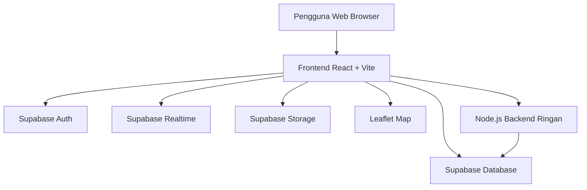
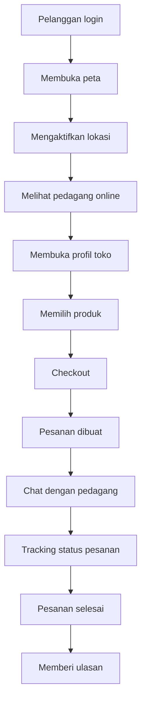
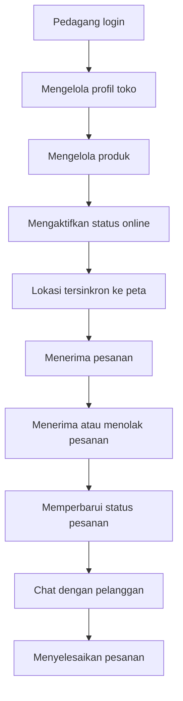
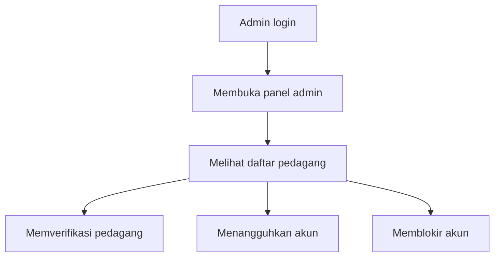
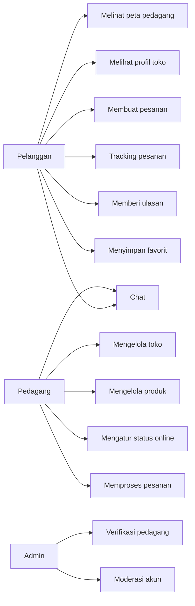
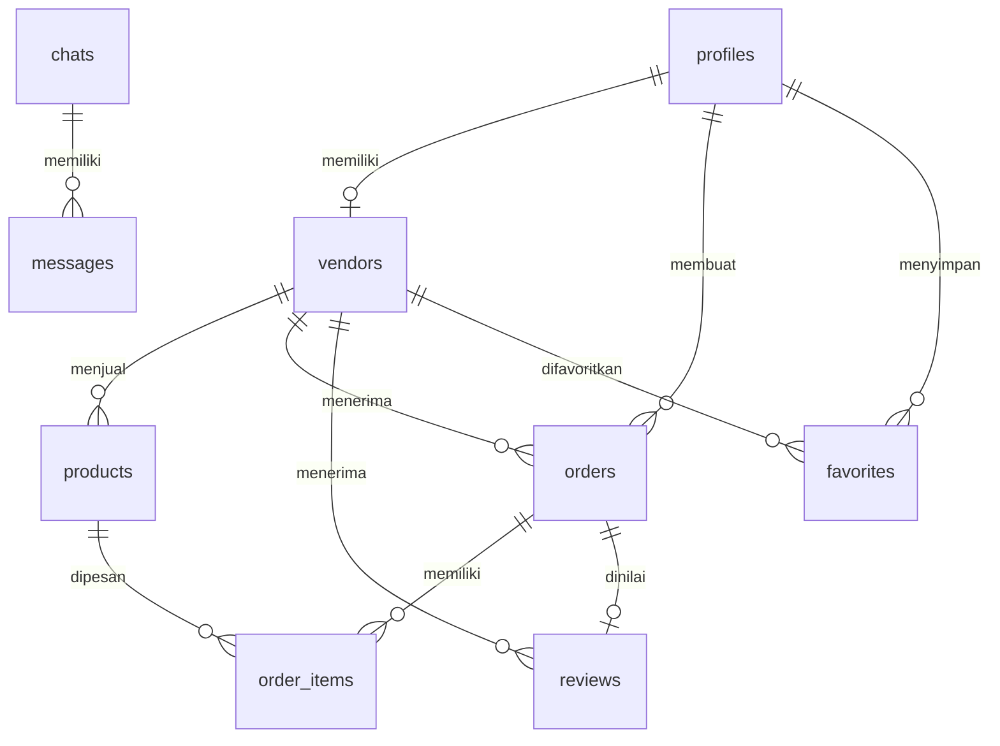

# Draf Seminar Proposal Skripsi

## Judul

**Rancang Bangun Aplikasi Marketplace Pedagang Keliling Berbasis Lokasi Menggunakan React dan Supabase**

Alternatif judul:

1. **Rancang Bangun Sistem Informasi Pemesanan Pedagang Keliling Berbasis Web dengan Fitur Peta dan Tracking Realtime**
2. **Pengembangan Aplikasi Kelilingku sebagai Platform Pemesanan Pedagang Keliling Berbasis Lokasi**
3. **Implementasi Location-Based Service pada Aplikasi Marketplace Pedagang Keliling Berbasis Web**

## Identitas Proposal

- Nama mahasiswa: `[isi nama mahasiswa]`
- NIM: `[isi NIM]`
- Program studi: `[isi program studi]`
- Fakultas: `[isi fakultas]`
- Perguruan tinggi: `[isi nama kampus]`
- Dosen pembimbing: `[isi nama dosen pembimbing]`
- Tahun: `2026`

---

# BAB I
# PENDAHULUAN

## 1.1 Latar Belakang

Pedagang keliling merupakan salah satu bentuk usaha mikro yang masih banyak ditemui dalam kehidupan masyarakat. Pedagang seperti penjual sayur, bakso, roti, kopi, gas, jajanan, dan kebutuhan harian lain umumnya melayani pelanggan dengan cara berpindah dari satu lokasi ke lokasi lain. Pola penjualan tersebut memiliki keunggulan karena dapat menjangkau pelanggan secara langsung, namun juga memiliki beberapa kendala operasional. Pelanggan sering kali tidak mengetahui posisi pedagang secara pasti, sedangkan pedagang belum memiliki media digital yang efektif untuk memberi informasi lokasi, katalog produk, status ketersediaan, dan menerima pesanan sebelum tiba di area pelanggan.

Pada sisi pelanggan, proses pembelian masih sangat bergantung pada keberuntungan bertemu pedagang di sekitar tempat tinggal. Jika pelanggan membutuhkan produk tertentu, pelanggan harus menunggu pedagang lewat atau menghubungi pedagang secara manual apabila memiliki kontaknya. Cara ini kurang efisien karena pelanggan tidak memperoleh informasi realtime mengenai lokasi pedagang, status online, produk yang tersedia, harga, maupun estimasi kedatangan. Pada sisi pedagang, keterbatasan media promosi dan komunikasi menyebabkan peluang transaksi dapat terlewat, terutama ketika pelanggan tidak mengetahui bahwa pedagang sedang berada di sekitar wilayahnya.

Perkembangan teknologi web, layanan lokasi, peta digital, dan database realtime membuka peluang untuk membangun sistem yang dapat mempertemukan pedagang keliling dengan pelanggan secara lebih terarah. Aplikasi berbasis lokasi memungkinkan pelanggan melihat pedagang aktif di sekitar mereka melalui peta, membuka profil toko, melihat katalog produk, melakukan pemesanan, berkomunikasi melalui chat, dan memantau status pesanan. Sementara itu, pedagang dapat mengelola profil toko, mengatur status online, memperbarui lokasi, mengelola produk, menerima pesanan, memperbarui status order, serta melihat riwayat transaksi.

Project website Kelilingku dikembangkan sebagai platform **map-first commerce**, yaitu aplikasi transaksi yang menjadikan peta sebagai pintu masuk utama. Aplikasi ini dibangun menggunakan React dan Vite pada sisi frontend, Supabase untuk database, autentikasi, realtime, storage, serta Node.js sebagai backend ringan untuk kebutuhan endpoint operasional. Fitur utama yang tersedia meliputi peta pedagang sekitar, autentikasi pengguna, peran pelanggan, pedagang, dan admin, profil toko, katalog produk, checkout, chat, notifikasi, tracking pesanan, pembayaran manual, ulasan, favorit, pre-order, serta panel admin untuk verifikasi dan moderasi pedagang.

Berdasarkan permasalahan tersebut, penelitian ini berfokus pada perancangan dan pembangunan aplikasi marketplace pedagang keliling berbasis lokasi. Sistem yang dikembangkan diharapkan dapat membantu pelanggan menemukan pedagang yang sedang aktif di sekitar lokasi mereka dan membantu pedagang mengelola proses transaksi secara lebih terstruktur.

## 1.2 Rumusan Masalah

Berdasarkan latar belakang di atas, rumusan masalah dalam penelitian ini adalah:

1. Bagaimana merancang aplikasi marketplace pedagang keliling berbasis lokasi yang dapat menampilkan pedagang aktif di sekitar pelanggan?
2. Bagaimana membangun sistem pemesanan yang menghubungkan pelanggan dan pedagang melalui katalog produk, checkout, chat, dan tracking status pesanan?
3. Bagaimana mengimplementasikan fitur realtime untuk pembaruan lokasi pedagang, notifikasi, pesan, dan status pesanan?
4. Bagaimana mengelola hak akses pengguna berdasarkan peran pelanggan, pedagang, dan admin?
5. Bagaimana menguji aplikasi agar fungsi utama berjalan sesuai kebutuhan pengguna?

## 1.3 Batasan Masalah

Agar penelitian lebih terarah, batasan masalah pada penelitian ini adalah:

1. Aplikasi yang dibangun berbasis web dan dioptimalkan untuk penggunaan mobile.
2. Sistem berfokus pada pedagang keliling seperti makanan, minuman, sayur, gas, roti, dan jajanan.
3. Fitur utama meliputi autentikasi, peta pedagang, profil toko, katalog produk, checkout, chat, tracking pesanan, notifikasi, ulasan, favorit, dan panel admin.
4. Pembayaran pada tahap penelitian menggunakan model manual, yaitu COD, QRIS manual, transfer bank, dan e-wallet manual. Payment gateway penuh tidak dibahas.
5. Lokasi pelanggan digunakan untuk kebutuhan transaksi dan tracking, bukan untuk disimpan sebagai riwayat lokasi permanen.
6. Aplikasi menggunakan React, Vite, Supabase, Leaflet, dan Node.js sesuai implementasi project.
7. Pengujian berfokus pada pengujian fungsional menggunakan black box testing dan evaluasi kelayakan fitur inti.

## 1.4 Tujuan Penelitian

Tujuan dari penelitian ini adalah:

1. Merancang aplikasi marketplace pedagang keliling berbasis lokasi yang dapat menampilkan pedagang aktif pada peta.
2. Membangun fitur transaksi mulai dari pencarian pedagang, melihat profil toko, memilih produk, checkout, chat, hingga tracking pesanan.
3. Mengimplementasikan fitur realtime untuk mendukung pembaruan lokasi, pesan, notifikasi, dan status pesanan.
4. Menerapkan manajemen peran pengguna untuk pelanggan, pedagang, dan admin.
5. Melakukan pengujian terhadap fungsi utama aplikasi untuk mengetahui apakah sistem berjalan sesuai kebutuhan.

## 1.5 Manfaat Penelitian

Manfaat penelitian ini dibagi menjadi manfaat bagi pelanggan, pedagang, admin, dan peneliti.

### 1.5.1 Bagi Pelanggan

1. Memudahkan pelanggan menemukan pedagang keliling yang sedang aktif di sekitar lokasi.
2. Memudahkan pelanggan melihat produk, harga, dan informasi toko sebelum memesan.
3. Memudahkan pelanggan melakukan pemesanan dan memantau status transaksi.
4. Menyediakan media komunikasi yang lebih rapi melalui fitur chat.

### 1.5.2 Bagi Pedagang

1. Membantu pedagang menampilkan status online dan lokasi toko secara realtime.
2. Memudahkan pedagang mengelola katalog produk dan informasi toko.
3. Membantu pedagang menerima pesanan sebelum tiba di lokasi pelanggan.
4. Menyediakan riwayat transaksi, ulasan, dan fitur operasional sederhana.

### 1.5.3 Bagi Admin

1. Membantu admin melakukan verifikasi pedagang.
2. Membantu admin memoderasi akun yang bermasalah.
3. Memberikan dasar pengawasan terhadap aktivitas pedagang dalam sistem.

### 1.5.4 Bagi Peneliti

1. Menambah pengalaman dalam merancang dan membangun aplikasi berbasis web.
2. Menambah pemahaman tentang implementasi location-based service, realtime database, dan role-based access.
3. Menjadi dasar pengembangan penelitian lanjutan pada bidang sistem informasi perdagangan mikro berbasis lokasi.

## 1.6 Metodologi Singkat

Penelitian ini menggunakan metode pengembangan perangkat lunak berbasis prototyping. Tahapan penelitian meliputi identifikasi masalah, pengumpulan kebutuhan, perancangan sistem, implementasi, pengujian, dan evaluasi. Model prototyping dipilih karena aplikasi membutuhkan penyesuaian bertahap terhadap alur pelanggan dan pedagang, terutama pada fitur peta, checkout, chat, tracking, dan dashboard.

## 1.7 Sistematika Penulisan

Sistematika penulisan proposal ini adalah sebagai berikut:

1. **BAB I Pendahuluan** berisi latar belakang, rumusan masalah, batasan masalah, tujuan, manfaat, metodologi singkat, dan sistematika penulisan.
2. **BAB II Landasan Teori** berisi teori-teori yang mendukung penelitian, seperti sistem informasi, marketplace, pedagang keliling, location-based service, React, Supabase, Leaflet, realtime database, dan pengujian black box.
3. **BAB III Metode Penelitian** berisi metode pengumpulan data, metode pengembangan sistem, analisis kebutuhan, rancangan sistem, rancangan database, rancangan antarmuka, serta rencana pengujian.

---

# BAB II
# LANDASAN TEORI

## 2.1 Sistem Informasi

Sistem informasi adalah kumpulan komponen yang saling berkaitan untuk mengumpulkan, mengolah, menyimpan, dan menyajikan informasi guna mendukung proses bisnis atau pengambilan keputusan. Dalam penelitian ini, sistem informasi digunakan untuk mengelola data pelanggan, pedagang, produk, pesanan, pesan, notifikasi, ulasan, dan informasi lokasi.

Aplikasi Kelilingku termasuk sistem informasi berbasis web karena pengguna dapat mengakses layanan melalui browser. Sistem ini memadukan proses bisnis perdagangan, layanan lokasi, dan komunikasi realtime agar transaksi antara pelanggan dan pedagang keliling dapat berjalan lebih terstruktur.

## 2.2 Marketplace

Marketplace adalah platform digital yang mempertemukan penjual dan pembeli dalam satu sistem. Marketplace umumnya menyediakan fitur katalog produk, pencarian, transaksi, komunikasi, pembayaran, dan riwayat pesanan. Pada penelitian ini, marketplace yang dibangun memiliki karakteristik khusus karena berfokus pada pedagang keliling. Dengan demikian, peta dan status lokasi pedagang menjadi bagian penting dalam proses pencarian dan transaksi.

Kelilingku tidak dirancang sebagai marketplace katalog umum, tetapi sebagai marketplace berbasis lokasi. Pelanggan tidak hanya memilih produk, tetapi juga melihat pedagang yang sedang aktif dan berada di sekitar area mereka.

## 2.3 Pedagang Keliling

Pedagang keliling adalah pelaku usaha yang menjual barang atau jasa dengan berpindah dari satu lokasi ke lokasi lain. Pedagang keliling memiliki hubungan langsung dengan pelanggan di wilayah tertentu, tetapi proses transaksi sering kali belum terdigitalisasi. Kendala yang umum terjadi antara lain pelanggan tidak mengetahui posisi pedagang, pedagang sulit menginformasikan rute atau status ketersediaan, dan proses pemesanan masih dilakukan secara manual.

Digitalisasi pedagang keliling dapat membantu meningkatkan efisiensi komunikasi, memperluas jangkauan pelanggan, dan memperbaiki pencatatan transaksi. Aplikasi berbasis lokasi dapat menjadi solusi karena karakter utama pedagang keliling adalah mobilitas.

## 2.4 Location-Based Service

Location-Based Service atau LBS adalah layanan yang memanfaatkan informasi lokasi pengguna atau objek tertentu untuk memberikan layanan yang relevan. Pada aplikasi Kelilingku, LBS digunakan untuk:

1. Menampilkan lokasi pedagang pada peta.
2. Menghitung jarak antara pelanggan dan pedagang.
3. Membantu pelanggan memilih pedagang terdekat.
4. Mendukung tracking pesanan.
5. Menentukan titik temu atau lokasi pengantaran.

Penggunaan lokasi harus memperhatikan privasi pengguna. Oleh karena itu, lokasi pedagang hanya ditampilkan saat pedagang mengaktifkan status online, sedangkan lokasi pelanggan digunakan sesuai kebutuhan transaksi.

## 2.5 Geolocation API

Geolocation API adalah fitur browser yang memungkinkan aplikasi web memperoleh posisi perangkat setelah pengguna memberikan izin. Dalam aplikasi ini, Geolocation API digunakan untuk membaca lokasi pelanggan dan pedagang. Lokasi pelanggan digunakan untuk menghitung jarak dan membantu titik temu, sedangkan lokasi pedagang digunakan untuk menampilkan marker pada peta dan memperbarui posisi saat toko online.

Karena akses lokasi termasuk data sensitif, aplikasi perlu menampilkan permintaan izin dan menangani kondisi ketika pengguna menolak akses lokasi atau perangkat tidak mendukung fitur tersebut.

## 2.6 Peta Digital dan Leaflet

Peta digital digunakan untuk menyajikan informasi geografis secara visual. Leaflet merupakan pustaka JavaScript open-source yang umum digunakan untuk membuat peta interaktif pada aplikasi web. Dalam project Kelilingku, Leaflet digunakan untuk:

1. Menampilkan peta utama.
2. Menampilkan marker pedagang.
3. Menampilkan marker lokasi pelanggan.
4. Menampilkan popup informasi toko.
5. Menampilkan rute atau garis tracking pesanan.

Dengan penggunaan Leaflet, aplikasi dapat menyediakan pengalaman map-first yang ringan dan sesuai untuk perangkat mobile.

## 2.7 React

React adalah pustaka JavaScript untuk membangun antarmuka pengguna berbasis komponen. React memudahkan pengembangan aplikasi karena tampilan dapat dipecah menjadi komponen-komponen yang dapat digunakan kembali. Dalam project Kelilingku, React digunakan untuk membangun halaman landing, login, peta, profil toko, dashboard, chat, tracking order, dan panel admin.

Pendekatan komponen membantu pengembangan fitur seperti kartu pedagang, daftar produk, panel pesanan, timeline status, form checkout, dan toast notifikasi agar lebih mudah dipelihara.

## 2.8 Vite

Vite adalah build tool modern untuk aplikasi frontend. Vite menyediakan development server yang cepat dan proses build untuk menghasilkan file produksi. Pada penelitian ini, Vite digunakan sebagai fondasi pengembangan frontend React sehingga proses pengembangan dan build aplikasi menjadi lebih efisien.

## 2.9 Supabase

Supabase adalah platform backend-as-a-service yang menyediakan database PostgreSQL, autentikasi, storage, realtime, dan API. Dalam aplikasi Kelilingku, Supabase digunakan untuk:

1. Menyimpan data profil pengguna dan pedagang.
2. Menyimpan data produk.
3. Menyimpan transaksi pesanan dan item pesanan.
4. Menyimpan chat dan pesan.
5. Menyediakan autentikasi pelanggan, pedagang, dan admin.
6. Menyediakan realtime update untuk lokasi, pesanan, pesan, dan notifikasi.
7. Menerapkan Row Level Security untuk pembatasan akses data.

## 2.10 Realtime Database

Realtime database adalah mekanisme yang memungkinkan perubahan data di server langsung diterima oleh client tanpa pengguna harus melakukan refresh manual. Pada aplikasi Kelilingku, realtime digunakan untuk memperbarui data penting seperti:

1. Status online dan lokasi pedagang.
2. Pesanan baru.
3. Perubahan status pesanan.
4. Pesan baru pada chat.
5. Notifikasi pengguna.

Fitur realtime penting karena transaksi pedagang keliling bergantung pada kondisi saat ini, terutama posisi pedagang dan status pesanan.

## 2.11 Role-Based Access Control

Role-Based Access Control atau RBAC adalah pengaturan hak akses berdasarkan peran pengguna. Dalam aplikasi Kelilingku terdapat tiga peran utama:

1. **Pelanggan**, yaitu pengguna yang mencari pedagang, membuat pesanan, chat, melacak pesanan, menyimpan favorit, dan memberi ulasan.
2. **Pedagang**, yaitu pengguna yang mengelola toko, produk, status online, lokasi, pesanan, pembayaran, dan chat.
3. **Admin**, yaitu pengguna yang memverifikasi pedagang, memoderasi akun, dan memantau data operasional dasar.

Penerapan RBAC membantu menjaga agar setiap pengguna hanya dapat mengakses fitur dan data yang sesuai dengan perannya.

## 2.12 Row Level Security

Row Level Security atau RLS adalah mekanisme keamanan database untuk membatasi akses pada tingkat baris data. Pada Supabase, RLS digunakan agar pelanggan hanya dapat membaca pesanan miliknya, pedagang hanya dapat mengelola produk dan pesanan tokonya sendiri, serta chat hanya dapat diakses oleh peserta percakapan.

Penerapan RLS penting karena aplikasi melibatkan data transaksi, identitas pengguna, lokasi, dan komunikasi.

## 2.13 Black Box Testing

Black box testing adalah metode pengujian perangkat lunak yang berfokus pada fungsi sistem dari sudut pandang pengguna tanpa melihat kode program. Pengujian dilakukan dengan memberikan input tertentu dan memeriksa apakah output atau perilaku sistem sesuai dengan hasil yang diharapkan.

Pada penelitian ini, black box testing digunakan untuk menguji fitur login, peta, filter pedagang, checkout, chat, update status pesanan, tracking, review, favorit, dan panel admin.

## 2.14 Penelitian Terkait

Bagian ini perlu disesuaikan dengan jurnal atau skripsi yang digunakan oleh mahasiswa. Secara umum, penelitian terkait dapat dikelompokkan menjadi:

1. Penelitian tentang marketplace UMKM berbasis web.
2. Penelitian tentang sistem pemesanan makanan atau produk lokal.
3. Penelitian tentang aplikasi berbasis lokasi.
4. Penelitian tentang tracking pesanan secara realtime.
5. Penelitian tentang digitalisasi pedagang kecil atau usaha mikro.

Contoh format tabel penelitian terkait:

| No | Peneliti | Tahun | Judul | Metode | Hasil | Perbedaan dengan penelitian ini |
| --- | --- | --- | --- | --- | --- | --- |
| 1 | `[isi]` | `[isi]` | `[isi]` | `[isi]` | `[isi]` | Penelitian ini berfokus pada pedagang keliling berbasis peta dan tracking realtime. |
| 2 | `[isi]` | `[isi]` | `[isi]` | `[isi]` | `[isi]` | Penelitian ini menambahkan peran pedagang, pelanggan, dan admin dalam satu platform. |
| 3 | `[isi]` | `[isi]` | `[isi]` | `[isi]` | `[isi]` | Penelitian ini menggunakan Supabase realtime dan fitur lokasi pedagang online. |

---

# BAB III
# METODE PENELITIAN

## 3.1 Jenis Penelitian

Jenis penelitian ini adalah penelitian terapan dengan pendekatan pengembangan perangkat lunak. Penelitian dilakukan untuk menghasilkan produk berupa aplikasi marketplace pedagang keliling berbasis lokasi yang dapat digunakan oleh pelanggan, pedagang, dan admin.

Pendekatan pengembangan yang digunakan adalah prototyping. Metode ini dipilih karena kebutuhan aplikasi dapat berkembang melalui evaluasi fitur dan tampilan, terutama pada alur utama peta, profil toko, checkout, chat, tracking, dashboard pedagang, dan panel admin.

## 3.2 Objek Penelitian

Objek penelitian ini adalah proses transaksi antara pelanggan dan pedagang keliling. Studi kasus yang digunakan adalah aplikasi Kelilingku, yaitu website yang mempertemukan pelanggan dengan pedagang keliling melalui peta, katalog produk, pemesanan, chat, dan tracking.

Lokasi penelitian: `[isi lokasi penelitian, misalnya Kota/Kabupaten ...]`

Subjek pengguna:

1. Pelanggan yang membutuhkan pedagang keliling di sekitar lokasi.
2. Pedagang keliling yang menjual produk secara berpindah tempat.
3. Admin yang bertugas melakukan verifikasi dan moderasi pedagang.

## 3.3 Metode Pengumpulan Data

Metode pengumpulan data yang digunakan dalam penelitian ini adalah:

### 3.3.1 Observasi

Observasi dilakukan dengan mengamati proses transaksi pedagang keliling secara langsung atau berdasarkan alur umum yang terjadi di masyarakat. Observasi difokuskan pada bagaimana pelanggan menemukan pedagang, cara pelanggan memesan, cara pedagang menerima pesanan, dan kendala komunikasi yang muncul.

### 3.3.2 Wawancara

Wawancara dilakukan kepada calon pengguna, yaitu pelanggan dan pedagang keliling. Pertanyaan wawancara mencakup kebutuhan informasi lokasi, kebutuhan katalog produk, metode pemesanan, kendala pembayaran, dan kebutuhan komunikasi.

Contoh pertanyaan untuk pelanggan:

1. Apakah pelanggan sering kesulitan mengetahui posisi pedagang keliling?
2. Informasi apa yang dibutuhkan sebelum memesan dari pedagang keliling?
3. Apakah pelanggan membutuhkan fitur chat dan tracking pesanan?

Contoh pertanyaan untuk pedagang:

1. Bagaimana pedagang biasanya menerima pesanan dari pelanggan?
2. Apakah pedagang membutuhkan fitur status online dan lokasi aktif?
3. Apakah pedagang membutuhkan katalog produk dan riwayat pesanan?

### 3.3.3 Studi Pustaka

Studi pustaka dilakukan dengan membaca referensi mengenai sistem informasi, marketplace, location-based service, aplikasi web, React, Supabase, Leaflet, Geolocation API, realtime database, role-based access control, dan black box testing.

### 3.3.4 Studi Dokumentasi Project

Studi dokumentasi dilakukan dengan menganalisis dokumentasi dan kode project Kelilingku, seperti struktur frontend, skema database, blueprint produk, roadmap implementasi, dan fitur yang telah dikembangkan.

## 3.4 Metode Pengembangan Sistem

Metode pengembangan sistem menggunakan prototyping dengan tahapan sebagai berikut:

1. **Analisis kebutuhan**: mengidentifikasi kebutuhan pelanggan, pedagang, dan admin.
2. **Perancangan cepat**: membuat rancangan alur sistem, database, dan antarmuka.
3. **Pembuatan prototype**: mengimplementasikan fitur utama aplikasi.
4. **Evaluasi prototype**: mengevaluasi fitur berdasarkan kebutuhan pengguna.
5. **Perbaikan sistem**: memperbaiki fitur, tampilan, alur transaksi, dan keamanan data.
6. **Pengujian**: melakukan black box testing pada fitur utama.
7. **Dokumentasi**: menyusun laporan hasil penelitian dan dokumentasi sistem.

## 3.5 Analisis Sistem Berjalan

Pada sistem berjalan secara manual, pelanggan biasanya memperoleh produk dari pedagang keliling dengan menunggu pedagang lewat, mendengar suara atau tanda dagangan, atau menghubungi pedagang melalui kontak pribadi. Sistem manual memiliki beberapa kelemahan:

1. Pelanggan tidak mengetahui posisi pedagang secara pasti.
2. Pelanggan tidak mengetahui produk dan stok yang tersedia.
3. Pedagang sulit menerima pesanan sebelum tiba di lokasi pelanggan.
4. Komunikasi transaksi masih tersebar di luar sistem.
5. Riwayat pesanan tidak tercatat dengan baik.
6. Tidak ada tracking status pesanan.
7. Tidak ada mekanisme verifikasi pedagang di platform digital.

## 3.6 Analisis Sistem Usulan

Sistem yang diusulkan adalah aplikasi marketplace pedagang keliling berbasis web. Sistem ini menyediakan peta sebagai halaman utama untuk menemukan pedagang yang sedang aktif. Pelanggan dapat memilih pedagang, melihat profil toko, memilih produk, membuat pesanan, membuka chat, dan memantau status pesanan.

Pedagang dapat mengaktifkan status online, membagikan lokasi, mengelola profil toko, menambah produk, menerima pesanan, memperbarui status order, mengatur metode pembayaran manual, dan membalas chat. Admin dapat memverifikasi pedagang dan melakukan moderasi akun.

## 3.7 Kebutuhan Fungsional

### 3.7.1 Kebutuhan Pelanggan

1. Pelanggan dapat melakukan registrasi dan login.
2. Pelanggan dapat melihat pedagang aktif pada peta.
3. Pelanggan dapat mencari pedagang berdasarkan nama, kategori, produk, radius, promo, favorit, dan rating.
4. Pelanggan dapat membuka profil toko pedagang.
5. Pelanggan dapat melihat produk, harga, stok, promo, metode pembayaran, dan ulasan.
6. Pelanggan dapat menambahkan produk ke keranjang.
7. Pelanggan dapat melakukan checkout.
8. Pelanggan dapat memilih metode pemenuhan, seperti titik temu atau pengantaran.
9. Pelanggan dapat memilih pesanan langsung atau pre-order.
10. Pelanggan dapat berkomunikasi dengan pedagang melalui chat.
11. Pelanggan dapat melacak status dan lokasi pesanan.
12. Pelanggan dapat menyimpan pedagang sebagai favorit.
13. Pelanggan dapat memberikan ulasan setelah pesanan selesai.

### 3.7.2 Kebutuhan Pedagang

1. Pedagang dapat melakukan registrasi dan login.
2. Pedagang dapat mengelola profil toko.
3. Pedagang dapat mengaktifkan atau menonaktifkan status online.
4. Pedagang dapat menyinkronkan lokasi toko.
5. Pedagang dapat mengelola produk, harga, gambar, stok, dan status ketersediaan.
6. Pedagang dapat menerima pesanan baru.
7. Pedagang dapat memperbarui status pesanan.
8. Pedagang dapat mengelola metode pembayaran manual.
9. Pedagang dapat membalas chat pelanggan.
10. Pedagang dapat melihat insight wilayah sederhana berdasarkan permintaan.

### 3.7.3 Kebutuhan Admin

1. Admin dapat login ke sistem.
2. Admin dapat melihat daftar pedagang.
3. Admin dapat memverifikasi pedagang.
4. Admin dapat menangguhkan atau memblokir akun pedagang.
5. Admin dapat melihat status dasar pedagang.

## 3.8 Kebutuhan Non-Fungsional

Kebutuhan non-fungsional sistem meliputi:

1. **Usability**: tampilan harus mudah digunakan pada perangkat mobile.
2. **Performance**: peta dan data transaksi harus dimuat secara efisien.
3. **Security**: akses data dibatasi berdasarkan peran pengguna.
4. **Reliability**: fitur transaksi, chat, dan tracking harus dapat diperbarui tanpa refresh manual.
5. **Privacy**: data lokasi digunakan sesuai kebutuhan dan tidak disimpan secara berlebihan.
6. **Maintainability**: struktur kode berbasis komponen agar mudah dikembangkan.

## 3.9 Teknologi yang Digunakan

| Teknologi | Fungsi |
| --- | --- |
| React | Membangun antarmuka pengguna berbasis komponen |
| Vite | Development server dan build frontend |
| Tailwind CSS | Styling antarmuka |
| React Router | Navigasi halaman aplikasi |
| Leaflet | Peta interaktif dan marker lokasi |
| Supabase Auth | Autentikasi pengguna |
| Supabase Database | Penyimpanan data aplikasi berbasis PostgreSQL |
| Supabase Realtime | Pembaruan data realtime |
| Supabase Storage | Penyimpanan gambar produk, toko, dan QRIS |
| Node.js | Backend ringan untuk endpoint operasional |

## 3.10 Perancangan Arsitektur Sistem

Arsitektur sistem terdiri dari frontend, backend ringan, dan Supabase sebagai layanan backend utama.

Penjelasan:

1. Pengguna mengakses aplikasi melalui browser.
2. Frontend React menampilkan halaman, form, peta, dashboard, chat, dan tracking.
3. Supabase Auth mengelola login dan identitas pengguna.
4. Supabase Database menyimpan data utama.
5. Supabase Realtime mengirim pembaruan data ke client.
6. Supabase Storage menyimpan file gambar.
7. Leaflet digunakan untuk visualisasi peta.
8. Node.js digunakan untuk kebutuhan endpoint operasional tambahan.

## 3.11 Perancangan Alur Sistem

### 3.11.1 Alur Pelanggan

### 3.11.2 Alur Pedagang

### 3.11.3 Alur Admin

## 3.12 Use Case Diagram

## 3.13 Perancangan Database

Database utama menggunakan Supabase PostgreSQL. Tabel yang digunakan antara lain:

| Tabel | Fungsi |
| --- | --- |
| profiles | Menyimpan data profil pengguna dan role |
| vendors | Menyimpan profil operasional pedagang |
| products | Menyimpan katalog produk pedagang |
| orders | Menyimpan data transaksi utama |
| order_items | Menyimpan detail item pesanan |
| chats | Menyimpan kanal percakapan |
| messages | Menyimpan pesan chat |
| notifications | Menyimpan notifikasi pengguna |
| reviews | Menyimpan rating dan ulasan |
| favorites | Menyimpan pedagang favorit pelanggan |
| categories | Menyimpan kategori dagangan |
| vendor_categories | Menyimpan relasi pedagang dan kategori |
| admin_actions | Menyimpan catatan tindakan admin |

### 3.13.1 Relasi Utama

## 3.14 Perancangan Antarmuka

Rancangan antarmuka aplikasi meliputi:

1. **Landing Page**: halaman awal aplikasi untuk pengenalan layanan.
2. **Login/Register Page**: halaman autentikasi pengguna.
3. **Map Page**: halaman utama untuk melihat pedagang online pada peta.
4. **Vendor Store Page**: halaman profil toko, katalog produk, ulasan, dan checkout.
5. **Dashboard Page**: halaman pelanggan atau pedagang untuk melihat pesanan, chat, produk, dan profil.
6. **Chat Page**: halaman percakapan pelanggan dan pedagang.
7. **Order Tracking Page**: halaman tracking status, jarak, estimasi tiba, peta, pembayaran, dan item pesanan.
8. **Admin Panel**: halaman admin untuk verifikasi dan moderasi pedagang.

## 3.15 Perancangan Pengujian

Pengujian dilakukan menggunakan black box testing. Fokus pengujian adalah memastikan setiap fitur utama berjalan sesuai kebutuhan.

| No | Fitur | Skenario Uji | Hasil yang Diharapkan |
| --- | --- | --- | --- |
| 1 | Login | Pengguna memasukkan email dan password valid | Pengguna masuk ke aplikasi sesuai role |
| 2 | Register pedagang | Pengguna mendaftar sebagai pedagang | Data profil dan vendor terbentuk |
| 3 | Peta | Pelanggan membuka halaman peta | Pedagang online tampil sebagai marker |
| 4 | Filter peta | Pelanggan memilih kategori/radius/rating | Daftar pedagang terfilter |
| 5 | Lokasi pedagang | Pedagang mengaktifkan status online | Lokasi pedagang tampil di peta |
| 6 | Produk | Pedagang menambah produk | Produk tampil di profil toko |
| 7 | Checkout | Pelanggan memilih produk dan mengirim pesanan | Pesanan tersimpan dengan status pending |
| 8 | Chat | Pelanggan mengirim pesan ke pedagang | Pesan tampil pada ruang chat |
| 9 | Status order | Pedagang mengubah status pesanan | Status berubah dan notifikasi terkirim |
| 10 | Tracking | Pelanggan membuka halaman tracking | Peta, status, jarak, dan detail pesanan tampil |
| 11 | Pembayaran manual | Pengguna mengubah status pembayaran | Status pembayaran berubah |
| 12 | Review | Pelanggan memberi ulasan setelah pesanan selesai | Ulasan tersimpan dan tampil di toko |
| 13 | Favorit | Pelanggan menyimpan pedagang favorit | Pedagang masuk daftar favorit |
| 14 | Admin verifikasi | Admin memverifikasi pedagang | Status pedagang menjadi terverifikasi |
| 15 | Admin moderasi | Admin menangguhkan atau memblokir akun | Status akun berubah dan akses operasional dibatasi |

## 3.16 Jadwal Penelitian

| No | Kegiatan | Minggu 1 | Minggu 2 | Minggu 3 | Minggu 4 | Minggu 5 | Minggu 6 | Minggu 7 | Minggu 8 |
| --- | --- | --- | --- | --- | --- | --- | --- | --- | --- |
| 1 | Identifikasi masalah | X |  |  |  |  |  |  |  |
| 2 | Pengumpulan data | X | X |  |  |  |  |  |  |
| 3 | Analisis kebutuhan |  | X | X |  |  |  |  |  |
| 4 | Perancangan sistem |  |  | X | X |  |  |  |  |
| 5 | Implementasi prototype |  |  |  | X | X |  |  |  |
| 6 | Pengujian sistem |  |  |  |  | X | X |  |  |
| 7 | Evaluasi dan perbaikan |  |  |  |  |  | X | X |  |
| 8 | Penyusunan laporan |  |  |  |  |  |  | X | X |

## 3.17 Hasil yang Diharapkan

Hasil yang diharapkan dari penelitian ini adalah aplikasi marketplace pedagang keliling berbasis lokasi yang dapat:

1. Menampilkan pedagang aktif di sekitar pelanggan melalui peta.
2. Memfasilitasi proses pemesanan dari katalog produk.
3. Menyediakan komunikasi chat antara pelanggan dan pedagang.
4. Menampilkan tracking status dan lokasi pesanan.
5. Mengelola peran pelanggan, pedagang, dan admin.
6. Meningkatkan efisiensi transaksi pedagang keliling secara digital.

---

# Daftar Pustaka Awal

Daftar pustaka ini masih perlu disesuaikan dengan standar kampus dan ditambah jurnal lokal atau internasional yang relevan.

1. React. (2026). *React Documentation*. https://react.dev/
2. Vite. (2026). *Vite Documentation*. https://vite.dev/
3. Supabase. (2026). *Supabase Documentation*. https://supabase.com/docs/
4. Leaflet. (2026). *Leaflet Documentation*. https://leafletjs.com/
5. MDN Web Docs. (2026). *Geolocation API*. https://developer.mozilla.org/en-US/docs/Web/API/Geolocation_API
6. PostgreSQL Global Development Group. (2026). *PostgreSQL Documentation*. https://www.postgresql.org/docs/
7. Pressman, R. S., & Maxim, B. R. (2019). *Software Engineering: A Practitioner's Approach*. McGraw-Hill.
8. Sommerville, I. (2016). *Software Engineering*. Pearson.

---

# Catatan Penyesuaian

Bagian yang sebaiknya dilengkapi sebelum seminar proposal:

1. Nama kampus, program studi, nama mahasiswa, NIM, dan dosen pembimbing.
2. Lokasi penelitian dan subjek responden.
3. Minimal 5-10 jurnal penelitian terkait.
4. Format sitasi sesuai pedoman kampus, misalnya APA, IEEE, atau Harvard.
5. Screenshot aplikasi untuk lampiran proposal.
6. Data hasil wawancara atau observasi awal.
7. Penyesuaian istilah apakah kampus lebih menyukai "rancang bangun", "pengembangan", atau "implementasi".
